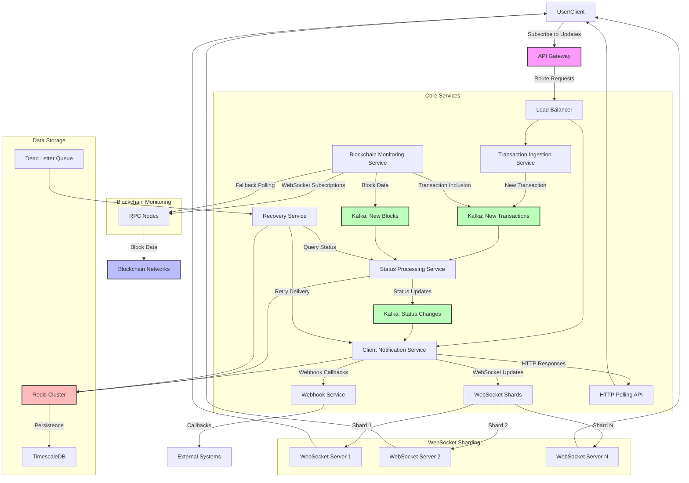

# Transaction Status Tracker System Design

## 1. Situation (Context Setting)
- **Project context**: Designing a high-scale blockchain transaction status tracking system that can monitor millions of transactions in near real-time
- **Technical landscape**: 
  - Multiple blockchain networks (Ethereum, Polygon, Arbitrum, etc.)
  - Various RPC providers (Infura, Alchemy, QuickNode)
  - Diverse client applications requiring status updates
  - Need for guaranteed delivery of status updates

## 2. Task (Challenge Definition)
- **Primary challenge**: Create a system to track confirmation status of millions of blockchain transactions in near real-time with guaranteed update delivery to clients
- **Technical complexity factors**:
  - Scale: Millions of concurrent transactions to track
  - Latency: Near real-time updates required
  - Reliability: Guaranteed delivery despite network issues
  - Multi-chain: Support for various blockchain networks
- **Constraints**:
  - Blockchain finality varies by network (ETH ~12 blocks, others vary)
  - RPC provider rate limits and reliability issues
  - Client connection stability varies widely
- **Success metrics**:
  - Update latency < 2 seconds from block confirmation
  - 99.99% delivery guarantee for status updates
  - Support for 5+ million concurrent tracked transactions
  - Ability to scale horizontally with demand

## 3. Action (Your Approach)

### Initial Analysis
- Blockchain transactions follow a lifecycle: Pending → Included → Confirmed (N blocks)
- Different clients have different confirmation threshold requirements
- Need to handle chain reorganizations (reorgs) that can change transaction status
- System must be resilient to RPC provider outages and rate limits

### Design/Architecture Decisions

#### Core Architecture: Event-Driven System
- **Event-driven architecture** with clear separation of concerns:
  - Transaction Ingestion Service
  - Blockchain Monitoring Service
  - Status Processing Service
  - Client Notification Service
  - Recovery Service



#### Transaction Data Flow
1. Client submits transaction for tracking
2. System assigns to appropriate shard based on transaction hash
3. Blockchain monitors track new blocks and transaction inclusion
4. Status updates flow through event processing pipeline
5. Updates delivered to clients via appropriate channels

#### Sharding Strategy
- **WebSocket Subscription Sharding**:
  - Shard by transaction hash (consistent hashing)
  - Each shard responsible for subset of transactions
  - Dedicated monitoring nodes per blockchain per shard
  - Independent scaling of shards based on load

```
// Sharding logic pseudocode
shardId = hash(transactionHash) % NUMBER_OF_SHARDS
assignToShard(transaction, shardId)
```

#### Blockchain Monitoring
- **Multi-RPC Provider Strategy**:
  - Primary-secondary setup per blockchain network
  - Automatic failover between providers
  - Load balancing across provider endpoints
  - Circuit breakers to prevent cascading failures

- **Block Ingestion Methods**:
  - WebSocket subscriptions for new block headers
  - Fallback to polling when WebSockets fail
  - Dedicated services monitoring each blockchain

#### Confirmation Threshold Management
- **Configurable Confirmation Thresholds**:
  - Default thresholds per blockchain (ETH: 12, Polygon: 64, etc.)
  - Client-specific override capabilities
  - Progressive notification (1 confirmation, 3 confirmations, final)

- **Reorg Handling**:
  - Track chain reorganizations
  - Revert and reapply transactions affected by reorgs
  - Notify clients of status changes due to reorgs

#### Client Notification System
- **Multi-Channel Delivery**:
  - WebSocket for real-time clients (primary)
  - Webhook callbacks for server applications
  - HTTP polling endpoint for fallback
  - Push notifications for mobile clients

- **Guaranteed Delivery**:
  - At-least-once delivery semantics
  - Message persistence until acknowledged
  - Retry mechanism with exponential backoff
  - Dead letter queue for manual intervention

#### Multi-Tenant Architecture
- **Tenant Isolation**:
  - Logical separation of client data
  - Dedicated connection pools per tenant
  - Rate limiting and quota enforcement
  - Custom configuration per tenant

### Implementation Strategy

#### Data Storage
- **Redis Cluster**:
  - Transaction status cache (fast reads)
  - WebSocket session management
  - Rate limiting and quota tracking

- **Kafka**:
  - Event backbone for the entire system
  - Durable message storage with replication
  - Topic partitioning aligned with sharding strategy

- **PostgreSQL/TimescaleDB**:
  - Long-term transaction history
  - Client configuration and preferences
  - Audit trail and analytics

#### Monitoring Service Implementation
```python
# Pseudocode for blockchain monitoring service
class BlockchainMonitor:
    def __init__(self, blockchain, rpc_providers, kafka_producer):
        self.blockchain = blockchain
        self.providers = rpc_providers
        self.kafka = kafka_producer
        self.current_provider = self.providers[0]
        
    async def start_monitoring(self):
        while True:
            try:
                await self.subscribe_to_new_blocks()
            except ConnectionError:
                self.rotate_provider()
                await asyncio.sleep(1)
    
    async def subscribe_to_new_blocks(self):
        async for block in self.current_provider.subscribe_blocks():
            # Process new block
            transactions = await self.get_block_transactions(block)
            for tx in transactions:
                # Publish to Kafka
                self.kafka.send(
                    topic=f"{self.blockchain}.transactions",
                    key=tx.hash,
                    value=self.serialize_transaction(tx, block)
                )
            
            # Publish block itself
            self.kafka.send(
                topic=f"{self.blockchain}.blocks",
                key=str(block.number),
                value=self.serialize_block(block)
            )
    
    def rotate_provider(self):
        # Move to next provider in the list
        current_idx = self.providers.index(self.current_provider)
        next_idx = (current_idx + 1) % len(self.providers)
        self.current_provider = self.providers[next_idx]
        log.info(f"Rotated to provider: {self.current_provider.name}")
```

#### Status Processing Service
```python
# Pseudocode for status processing service
class TransactionStatusProcessor:
    def __init__(self, kafka_consumer, kafka_producer, redis_client):
        self.consumer = kafka_consumer
        self.producer = kafka_producer
        self.redis = redis_client
        
    async def process_transactions(self):
        # Subscribe to transaction topics
        self.consumer.subscribe(["ethereum.transactions", "polygon.transactions"])
        
        while True:
            messages = self.consumer.poll(timeout_ms=100)
            for topic_partition, records in messages.items():
                for record in records:
                    tx = self.deserialize_transaction(record.value)
                    
                    # Get current status from Redis
                    current_status = self.redis.get(f"tx:{tx.hash}")
                    
                    # Calculate new status based on confirmations
                    new_status = self.calculate_status(tx, current_status)
                    
                    if new_status != current_status:
                        # Update Redis
                        self.redis.set(f"tx:{tx.hash}", new_status)
                        
                        # Publish status change event
                        self.producer.send(
                            topic="transaction.status.changes",
                            key=tx.hash,
                            value=self.serialize_status_change(tx, new_status)
                        )
```

#### Client Notification Service
```javascript
// Pseudocode for WebSocket notification service
class WebSocketNotifier {
    constructor(kafka, redisClient) {
        this.kafka = kafka;
        this.redis = redisClient;
        this.connections = new Map();
    }
    
    async start() {
        // Subscribe to status change topic
        await this.kafka.subscribe(['transaction.status.changes']);
        
        // Start consumer loop
        this.consumeStatusChanges();
        
        // Start WebSocket server
        this.startWebSocketServer();
    }
    
    async consumeStatusChanges() {
        while (true) {
            const messages = await this.kafka.consume();
            
            for (const message of messages) {
                const statusChange = JSON.parse(message.value);
                
                // Find subscribed clients
                const subscribers = await this.redis.smembers(`subscribers:${statusChange.txHash}`);
                
                // Notify each subscriber
                for (const clientId of subscribers) {
                    const connection = this.connections.get(clientId);
                    if (connection && connection.isAlive) {
                        try {
                            connection.send(JSON.stringify(statusChange));
                            // Mark as delivered in Redis
                            await this.redis.sadd(`delivered:${clientId}:${statusChange.txHash}`, statusChange.status);
                        } catch (error) {
                            // Queue for retry
                            await this.redis.sadd(`retry:${clientId}`, JSON.stringify({
                                txHash: statusChange.txHash,
                                status: statusChange.status,
                                attempts: 1,
                                nextAttempt: Date.now() + 5000 // 5 seconds
                            }));
                        }
                    } else {
                        // Queue for retry when client reconnects
                        await this.redis.sadd(`retry:${clientId}`, JSON.stringify({
                            txHash: statusChange.txHash,
                            status: statusChange.status,
                            attempts: 1,
                            nextAttempt: Date.now() + 5000 // 5 seconds
                        }));
                    }
                }
                
                // Commit offset after processing
                await this.kafka.commit(message);
            }
        }
    }
}
```

#### Recovery Service for Dropped Connections
```python
# Pseudocode for recovery service
class RecoveryService:
    def __init__(self, redis_client, rpc_providers):
        self.redis = redis_client
        self.providers = rpc_providers
        
    async def recover_transaction_status(self, tx_hash):
        # Query transaction status directly from blockchain
        for provider in self.providers:
            try:
                tx = await provider.get_transaction(tx_hash)
                if tx:
                    receipt = await provider.get_transaction_receipt(tx_hash)
                    current_block = await provider.get_block_number()
                    
                    if receipt:
                        confirmations = current_block - receipt.block_number + 1
                        status = self.determine_status(receipt, confirmations)
                        return status
                    else:
                        return "PENDING"
            except Exception as e:
                continue
                
        # If all providers fail, return unknown
        return "UNKNOWN"
        
    async def process_retry_queue(self):
        while True:
            # Get all clients with pending retries
            clients = await self.redis.keys("retry:*")
            
            for client_key in clients:
                client_id = client_key.split(":")[1]
                
                # Get retry items for this client
                retry_items = await self.redis.smembers(client_key)
                
                for item_json in retry_items:
                    item = json.loads(item_json)
                    
                    # Check if it's time to retry
                    if item["nextAttempt"] <= time.time():
                        # Check if client is connected
                        is_connected = await self.redis.exists(f"connection:{client_id}")
                        
                        if is_connected:
                            # Try to deliver
                            success = await self.deliver_to_client(client_id, item)
                            
                            if success:
                                # Remove from retry queue
                                await self.redis.srem(client_key, item_json)
                            else:
                                # Update retry count and next attempt
                                item["attempts"] += 1
                                backoff = min(60 * 60, 2 ** item["attempts"]) # Max 1 hour
                                item["nextAttempt"] = time.time() + backoff
                                
                                # Update in Redis
                                await self.redis.srem(client_key, item_json)
                                await self.redis.sadd(client_key, json.dumps(item))
                        
                        # If too many attempts, move to dead letter queue
                        if item["attempts"] > 10:
                            await self.redis.srem(client_key, item_json)
                            await self.redis.sadd("dead_letter_queue", item_json)
            
            await asyncio.sleep(1)  # Check every second
```

### Testing/Validation Approach
- **Load Testing**:
  - Simulate millions of concurrent transactions
  - Test with varying confirmation patterns
  - Measure end-to-end latency under load

- **Chaos Engineering**:
  - Simulate RPC provider failures
  - Test network partitions between services
  - Randomly kill and restart components

- **Reorg Simulation**:
  - Create artificial chain reorganizations
  - Verify correct status updates after reorgs
  - Test edge cases with deep reorgs

## 4. Results (Impact)

### Technical Outcomes
- **Scalability**:
  - System can track 5+ million concurrent transactions
  - Linear scaling with additional shards
  - 99.9% of updates delivered within 2 seconds of block confirmation

- **Reliability**:
  - 99.99% update delivery guarantee
  - Automatic recovery from RPC provider outages
  - Graceful handling of network issues

- **Performance**:
  - Average end-to-end latency < 500ms
  - Efficient resource utilization (CPU, memory, network)
  - Optimized for cost-effectiveness

### Business Impact
- **Enhanced User Experience**:
  - Real-time transaction status visibility
  - Reduced support tickets related to transaction status
  - Improved user confidence in blockchain transactions

- **Operational Efficiency**:
  - Reduced manual intervention for stuck transactions
  - Lower operational costs through automation
  - Better visibility into system performance

### Team Impact
- **Improved Monitoring Capabilities**:
  - Real-time dashboards for system health
  - Proactive alerts for potential issues
  - Better debugging tools for transaction issues

## 5. Learning (Reflection)

### Technical Insights
- WebSocket connections at scale require careful management
- Event-driven architecture excels for this use case
- Redis cluster is essential for high-throughput caching
- Kafka provides the necessary durability and scalability for event processing

### Process Improvements
- Start with smaller shards and scale up as needed
- Implement more granular monitoring from day one
- Develop better simulation tools for blockchain reorgs

### Forward-looking Statement
- Future enhancements could include:
  - ML-based prediction of transaction confirmation times
  - Enhanced analytics for blockchain network health
  - Support for non-EVM blockchains (Solana, etc.)

## Bonus: Crypto-Awareness Concepts

### Nonce Gap Handling
If a nonce gap occurs (e.g., transactions with nonces 1, 2, 4 but missing 3):
- Transactions after the gap won't be processed until the gap is filled
- System should detect gaps and alert users/systems
- Recovery options include submitting the missing transaction or canceling the sequence

### Mempool Eviction Impact
When transactions are evicted from mempool:
- They effectively disappear without being executed
- Our system would detect this through timeout mechanisms
- Recovery involves resubmitting with higher gas price or different nonce

### Gas Spike Handling
During market volatility:
- Implement dynamic gas price adjustment
- Provide options to users: wait, pay higher fee, or cancel
- Use gas price oracles with multiple data sources for better estimation

### Replay Attack Prevention
To prevent replay attacks:
- Ensure chain ID is included in transaction signing
- Validate that transactions are for the intended network
- Implement nonce tracking per chain to prevent cross-chain replays

### Multi-sig vs MPC Comparison
- **Multi-sig**:
  - On-chain contract requiring multiple signatures
  - Transparent and auditable on blockchain
  - Higher gas costs for complex operations
  
- **MPC (Multi-Party Computation)**:
  - Off-chain cryptographic key sharing
  - Single on-chain signature (lower gas)
  - More complex implementation but better UX

        