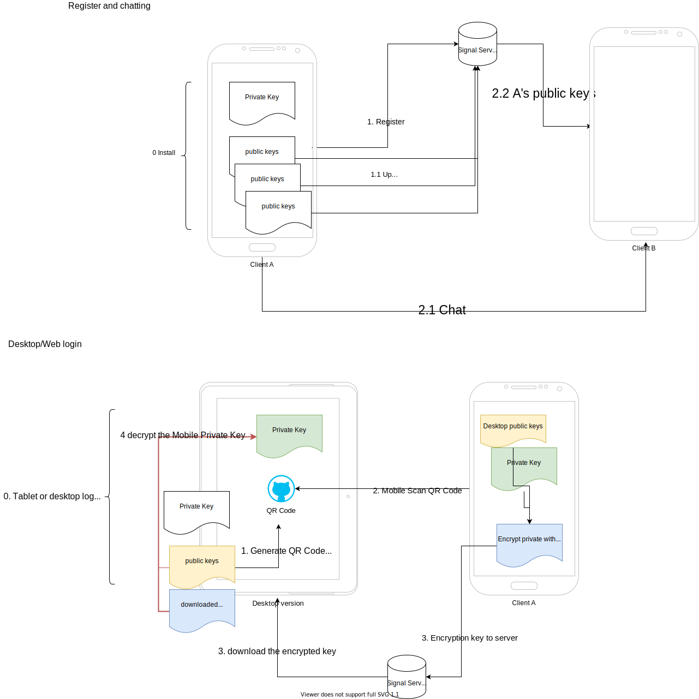

# mobileSystemDesign 移动系统设计知识点

## Common Categories of Clarification Questions
1. Scale and Performance : Questions about data volume, operation frequency, and performance requirements.
2. Edge Cases : Identifying boundary conditions and unusual inputs.
3. Error Handling : How to handle invalid inputs or failure conditions.
4. Concurrency : Whether thread safety is required and how to handle concurrent access.
5. Persistence : Whether data needs to persist beyond program execution.

## 系统设计时间模板
* 时间分配
* 5 minutes - acquaintance 寒暄
* 5–10 minutes - defining the task 定义任务(问问题，理清需求)
* 25–30 minutes - solution 
    * API
    * 定义Model(根据需求)
    * 数据使用估计
    * 高层实际
    * 细节设计
    * 瓶颈
* 5 minutes - your questions to an interviewer.()

### [详解时间分配模板](./SystemDesignInterviewTimeTemplate.md)

## Category
* Direct Message
* Social Network
* Position sharing
* Video Sharing
* Live Video
* Photo Sharing
* Matching based on location

## Business Idea
* Direct Message
	* Connect people
* Social Network
	* Extended social 
* Position sharing
	* Better navigation
* Video Sharing
	* Better sharing
* Live Video
	* Better interaction
* Photo Sharing
	* Sharing better life
* Matching based on location
	* Better communicate
* E-commercial	
* Extended social interaction beyond physical 
* Make search easy
* Safe backup, extend of your phone
* Shopping made easy, less hassle

## Use cases
### Question
AS STAR
* A: Availability
* S: Scalability/Performace

* S: Security p2p/server
* T: Testability CI/CD
* A: Accessbility accessibility engineer
* R: resource Battery/CPU/Storage
* Availability 
	* country
		* Europe/ gdpr
		* China, google play service and google play store
		* India, low internet speed and coverage
	* OS/language
		* Lollipop 21, permission
		* google play store needs new app *API level 28* above
	* Multiple Lauguage & cultures
		* especially Persian
	* offline
	* phone/tablet
* Scalability/Performance
	*  scalability of our team
		* how many team do we have involving this feature
		* how do we separate feature across teams
		* how do we reuse our code

* Security 
	* how security requirement for our data
	* fundamental: 
		* wss, https, tls
		* gRPC
		* sockets
	* P2P
		* Private key/public key in device
* Testability 
	* CI automation test
	* do we have QA already?
	* do they have related experiences?
	* do need training?
	* Separate of concern, massive unit test, little ui test, 
		* TEST Pyrid
	* A/B
		* customization
		* Tester plan
		* Releease phrase
* Accessibility
	* accessiblity needs, legal risk 	
	* Talk back, color contrast
	* Make accessibility part of the planing/design process

* Resources 资源使用的计算
    * Image Cache
        * LRU, 
    * Database
        * Table records * number
        * clean
    * Data
        * WIFI/Data selection
        * 网络状况决定当前行为的必要性
            * 视频有必要
            * 其他的，如API，Image，Audio，没有太多的必要
    * Battery   
        * 不要用foreground service
        * AlarmManager
        * WorkManager
            * 充电，wifi，晚上，没人用
        * SyncAdapter
### Concerns
* App size
	* 每增1M，减少约0.5%的install(decrease in install rate of 0.32% per MB)
	* CPU architecture by supporting different ABI(ARM64, arm, x86, x64)
	* Bundle

## Server Concerns
### Restful API
* limit
* paganation
	* offset based
	* curcor based
* filter
### Websocket
### WebRTC
### RTP/RTMP
### Dash
### gRPC
##  Android technology alternative
* Internet
	* Message
		* Json
			* {type:1, timestamp:1993828239}
		* Restful API
			* HTTP HEADER from 200 bytes to over 2KB
			* Content 60B
		* Websocket
			* 2B header, 4B timestamp, 1B event = 7B per event
		* tradeoffs
			* websocket is good saving data
			* Json is good if cost is not a concern
			* Http is good when not too much requests
		* Data cost
			* 2.5G/$16 = 120M/刀
	* Media
		* Upload
			* Background upload, fire and forgot, 
				* notification of finish/error retry
			* Android Upload Service
			* Http Upload
		* Download
			* Picaso
			* Volley
			* Image Cache
* storage
	* database
		* sqlite
		* room `part of Jackpack`
	* sharedpreferences
	* file
	* Firebase Firestore
* offline
	* store 
	* retry, exponential backoff && max retry
	* discard
* reminder
	* notification
* background/schedule tasking
	* forever
		* foreground service
	* immediate
		* Kotlin Coroutine
		* Foreground Service
		* WorkManager
	* deferred
		* DownloadManager
	* exact	
		* AlarmManager
		* WorkManager
* idle mode
* dependency injecetion
	* dagger
	* hilt
* location
	* The fused location provider from google play service
	* locationListener from location manager
		* GPS_PROVIDER
		* NETWORK_PROVIDER
		* PASSIVE_PROVIDER

	```
	var dir: Double,
    var fix: Int, accuracy
    var hdop: Double,
    var lat: Double,
    var lon: Double,
    var pSpd: Double,
    var rssi: Double?,
    var sat: Int, number of satallat
    var spd: Double, // kmph
    var timestamp: Long, // system timestamp when data created
    var gpsTime: Long // gps time of this data
	```
* end to end encryption

	When you first register on Signal, a private `identity key` is generated on your phone, as well as a bunch of public `prekeys` that are uploaded to the server and sent to your contacts whenever they initiate a new conversation with you or you initiate a new conversation with them.

	When you add a new instance of Signal Desktop to your account, the desktop client 
	1. generates a keypair, 
	2. encodes the public key as a QR code, 
	3. you scan it with your phone
	4. the phone encrypts your private 'identity key' to the desktop client’s public key and uploads the encrypted key to the Signal server, 
	5. the desktop client then downloads and decrypts your 'identity key' and uses it to generate a new set of public 'prekeys' that are uploaded to the server.		

	
## 共通问题
* reliable
* scalable
* maintainable
* power efficiency
* customizable
* cost efficiency
* secure

* 模块化
* 离线
* Scalability
* Picture-in-Picture
* Bandwidth Consumption/Data 流量
* Battery Consumption 电池
* Persistance 存储
* Resilience
* Device Support / Api
* Memory Usage
* Multiple language
* feature flag
* A/B TEST
## android 安卓相关
* 架构相关: 
    * MVP, MVVM, MVC, MVI, VIPER, MV*, RIBS, MV-Flow
    * 能说出优缺点
* MV-Flow
    * The library introduces few - if any - new concepts outside MVI, Kotlin coroutines, and Kotlin flows.
        * Any MVI library needs to accomplish the following tasks:
            * Manage the current state (Model in MVI)
            * Call a render function when the state changes (View in MVI)
            * Detect user interactions (Intent in MVI)
            * Process user intents, potentially mutating the current state
    * https://pedroql.github.io/mvflow/#objectives
    * lifecycle components, nav-graph of course, view-models may be, but lifecycleScope certainly, and all data exchange between ui-domain is observables of 'events' and 'states'. either a lifecycle-event, or a user-generated event such as on-click, triggers an appropriate 'event' posted to the domain-layer
    * domain and data layers communicate via flow-data components
    * domain exposes ui-contract and data-contract
        * repo/db/network/
            * retrofit
            * room-orm

* unit-testing
    * mock components, mockk
    * mock ui-contract, mock data-contract
    * mock webserver/mock web response

* UI相关
    * RecyclerView 
        * recyclerview-adapter, view-holder pattern
			* view holder pattern
			* layout manager
			* item animation
    * 图片缓存(how Glide/Picasso works basically)
    * Activity/Fragment/Navigation
* Kotlin相关
    * lifecycleScope or viewModelScope 


* Unidirectional data flow
	* 好处
		* 更容易测试，state和UI decouple
		* state独立，single source of truth，不容易出现inconsistent state
		* UI consistence observable state holders: LiveData, StateFlow
## APP分类

设计的APP一般可以分为两大类

* 获取数据，显示数据，from a simple fetch data and show lists of items on the device screen
* 聊天/Messaging/数据备份 to build this IOT or real-time chat-app ( WRT - web realtime messaging ) kind of an application    

* Direct Message
* Social Network
* Position sharing
* Video Sharing
* Live Video
* Photo Sharing
* Matching based on location


## Exaiople App
## How would you design Instagram / Instagram Stories
* Instagram/Instragram stories

## How would you design Facebook

## How would you design Facebook Messenger

## How would you design Facebook's live update of comments on posts

## How would you design an online collaborative editor (e.g. Google Docs)

## How would you design a typehead feature (e.g. Google search autocomplete)

## How would you design Twitter's trending topics

## How would you design a distributed Botnet

## How would you design TikTok

## How would you design Zoom
## How would you design Spotify
## How would you design Google Maps
## How would you design Google Photos
## How would you design Uber
## How would you design Dropbox
## How would you design Photo Edit
