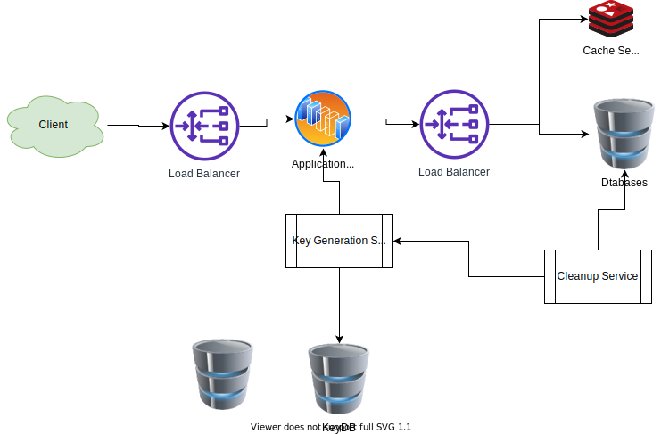

# 短链接服务
## 需求
### 功能性
* 创建
* 访问
* 定制
* 失效
### 非功能性
* 可用性
* 低延迟
* 扩展性
    * RESTful API

## 估算
每个月500M new URL 

* Read
* QPS

## Databae
Read only, so no sql is better

## Basic design and Algorithm

### encoding the URL
Hash(md5/SHA256) --> encode(Bas64)

for base64, 64^6 ~= 68.7 billion, 64 ~= 281 trillion, so that's enough letters.

String ---Hash---> 128 bit hash bytes value --base64 encode----> 21+ characters ----6,8 letters ----> keys

* Hash
    
    MD5 produces a 128bit hash value.

* base64

    each bas64 character encodes 6 bits

We got 21 characters. We chose the first 6-8 letters for keys.

### Generationg keys offline

A standalone Key Generation Service(KGS) generates random 6-8 letters before hand and store them in a database.

### Partitioning and Replication

* Hash based partitioning
根据Hash的结果来随机的分配URL到不同的server，仍然会出现非常不平均的分配。此处，我们可以用Consistent Hashing

### Cache

(Hash,key) in memory or MemCached

* How much cache we hold
20% daily traiffice

LRU

~[shortUrl cache](./graphs/shortenUrlCaches.drawio.svg)

## Purging or DB cleanup
怎么处理 Expirated Data，
* 访问并删除
* clean up service

    